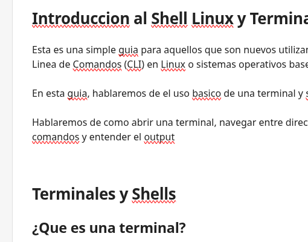

# Introduccion al Shell Linux y Terminales.

Esta es una simple guia para aquellos que son nuevos utilizando la Interfaz de Linea de Comandos (CLI) en Linux o sistemas operativos base Unix.

En esta guia, hablaremos de el uso basico de una terminal y shell en Linux.

Hablaremos de como abrir una terminal, navegar entre directorios, correr comandos y entender el output

# Terminales y Shells

## ¿Que es una terminal?

Lo que es comunmente llamado como "Shell", "CLI" y "Terminal" es el mismo programa que permite  interactuar enviando comandos basados en texto.

Para ser tecnico,aunque, la  "terminal" es solamente un componente de ese programa.
En el pasado, un "Terminal" era un dispotivo fisico con un teclado y una pantalla la cual podias utilizar para escribir comandos.

## ¿Que es un shell?

Si tu terminal es un programa que te permite enviar comandos basados en texto y mostrarte el output de esos comandos.. Entonces ¿Cual es el programa que interpreta esos comandos?
Ese es el "Shell".

el Shell, realiza multiples cosas, pero la principal es interpretar los comandos que le envias, y ejecutarlos.

## REPL

las Shells son conocidas por

- 

---
#guide